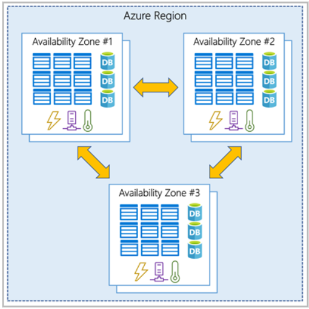

#AZ900: Azure Fundamentals

# Module 1

## Cloud Computing
- lets you choose the power and features you need to run your software.
- Pay for only the services you use
- Someone else manage the upkeep of the computer

### Computer Power
- Main service that cloud computing provides (computing service)
- How much processing your computer can do (=RAM)
- Cloud computing allows users to add/remove computer power as you need it (=cost save)

### Storage
- Service component of cloud computing
- Volume of data (=Hard Drive Space)
- Backups, OS up to date, Up and running for 24-hour a day.

## Shared responsibility model
- Saas: Software as a service
- Paas: Platform as a service
- Iaas: Infrastructure as a service

C: Customer responsibility  
M: Microsoft responsibility  
S: Shared responsibility   

|**Responsibility** | **Saas** | **Paas** | **Iaas** |
|----------------|------|------|------|
|Information and data | C | C | C |
Devices | C | C | C | C |
Accounts and identities | C | C | C |
Identity and directory infrastructure | S | S | C |
Applications | M | S | C |
Network controls | M | S | C |
Operating system | M | M | C |
Physical hosts | M | M | M |
Physical network | M | M | M |
Physical datacenter | M | M | M |

- Always customer's responsible for:
  - The information and data stored in the cloud
  - Devices that are allowed to connect to the cloud
  - Accounts and identities of the people, services, and devices within the organization

- Always Cloud provider's responsible for:
  - The physical datacenter
  - The physical network
  - The physical hosts

- Customer's responsibility:
  - Iaas > Paas > Saas

## Cloud models
- deployment type of cloud resources.

### Private cloud
- Natural evolution from a corporate datacenter.
- Used by a single entity
- Provides much greater control for the company
- Greater cost & fewer benefit

#### ↕ difference: general public availiability

### Public cloud
- Built, controlled, and maintained by a third-party cloud provider

### Hybrid cloud
- uses both public & private cloud in an inter-connected environment

public cloud | private cloud | Hybrid cloud
-------------|---------------|-------------
No capital expenditures to scale up | Organizations have complete control over resources and security | Provides the most flexibility
Applications can be quickly provisioned and deprovisioned | Data is not collocated with other organizations' data | Organizations determine whtere to run their applications
Organizations pay only for what they use | Hardware must be purchased for startup and maintenance | Organizations control security, compliance, or legal requirements
Organizations don't have complete control over resources and security | Organizations are responsible for hardware maintenance and updates

### Multi-cloud
- Use multiple **public** cloud providers.
- use different features from different cloud providers
- Started using a cloud service, and are in process of migrating to a different provider.
- = Deal with 2+ public cloud providers and manage resources and security in both environment.

### Azure Arc
- Set of technologies that helps manage cloud environment.

### Azure VMware Solution
- Lets you run your VMware workloads in Azure with seamless integration and scalability.

## Consumption-based model
### Capital expenditure (CapEx)
- one-time, up-front expenditure to purchase or secure tangible resources
- (Ex: new building, repaving parking lot, building a datacenter)

### Operational expenditure (OpEx)
- spending money on services or products over time
- (Ex: renting a convention center, leasing a car, **sign up for cloud services**)

### Cloud computing is OpEx
- Pay for IT resources you use → consumption-based model
- No upfront costs
- No need to purchase & manage costly infrastructure that users might not use
- The ability to pay for more resources when they're needed.
- The ability to stop paying for resources that are no longer needed.

# Module 2

## Benefits of high availability and scalability in the cloud

### High availability
- Azure is a highly available cloud environment with uptime guarantees depending on the service.
- SLAs: Service-Level Agreements
  - Formal agreement between a service provider and customer
  - Guarantees the customer a stated level of service
- Azure SLA
  - represented as a percentage, related to the service or application's availability
  - (Availability = up time) → 100% available / 100% uptime = service is always available to use
  - (Unavailability = down time) → used for required maintenance or upgrades
  - Why maintaining 100%  uptime is difficult?
    - No time for maintenance / update
    - require duplicating every single component in case one component failed
    - require those backup components to pick up the service tasks with zero interruption to the customer
  - 99% and 99.9% differences?
    - 99% can be unavailable for up to 1.6 hours/week or 7.2 hours/month (Time cumulative)
    - 99.9% can be unavailable only 10 minutes/week or 43.2 minutes/month

### Scalability
- Ability to adjust resources to meet demand.
- **Vertical scaling**
  - to add more CPUs or RAM to the virtual machine (more processing power)
- ** Horizontal scaling**
  - suddenly experienced a steep jump in demand.
  - add additional virtual machines or containers, scaling out.

## Benefits of reliability and predictability in the cloud  

### Reliability
- Ability of a system to recover from failures and continue to function.
- cloud = decentralized design → naturally supports a reliable and resilient infrastructure.

### Predictability
- can be focused on **Performance predictability** or **Cost predictability**.
- Performance
  - focuses on predicting the resources needed to deliver a positive experience for your customers.
  - Autoscaling, load balancing, high availability
- Cost
  - focuses on predicting or forecasting the cost of the cloud spend.
  - Track resource use in real time, monitor resources to ensure most efficient way of using, apply data analytics to find patterns and trends
  - use tools like to Total Cost of Ownership (TCO) or pricing calculator

## Benefits of security and governance in the cloud
- Depending on your operating model, software patches and updates may also automatically be applied, which helps with both governance and security
- Security
  - can find a cloud solution that matches security needs.
  - IaaS: provides physical resources / let you manage the os and installed software, including patches and maintenance. (Max control of security)
  - PaaS: patches and maintenance taken care of automatically
- cloud is intended as an over-the-internet delivery of IT resources
- Typically, well suited to handle things like DDoS (Distributed Denial of Service) attacks, making network more robust and secure

## Benefits of manageability in the cloud
- Two types of manageability for cloud computing: Management **of** the cloud, Management **in** the cloud
- Management of the cloud: speaks to managing your cloud resources
  - automatically scale resource deployment based on need
  - Deploy resources based on a preconfigured template, removing the need for manual configuration
  - Monitor the health of resources and automatically replace failing resources
  - Receive automatic alerts based on configured metrics, so you're aware of performance in real time
- Management in the cloud: speaks to how you're able to manage your cloud environment and resources.
  - Through a web portal
  - Using a command line interface
  - Using APIs
  - Using PowerShell

# Module 3

## Describe Infrastructure as a Service

- IaaS is the **most flexible** category of cloud services
  - It provides maximum amount of control for the cloud resources
  - Cloud provider is responsible for maintaining the hardware, network connectivity, and physical security
  - Customer responsible for everything else: OS installation, configuration, network, database and storage...
  - It's like renting the hardware in a cloud datacenter
- Common scenarios:
  - Lift-and-shift migration:
    - standing up cloud resources similar to the on-prem datacenter, and then simply moving the things running oni-prem to running on the IaaS infrastructure
  - Testing and development:
    - Established configurations for development and test environments that you need to rapidly replicate.
    - Stand up or shut down the different environments rapidly with an IaaS structure, while maintaining complete control

## Describe Platform as a Service

- Paas Is a **middle ground** between renting space in a datacenter(IaaS) and paying for a complete and deployed solution (SaaS)
  - Cloud provider maintains the physical infrastructure, physical security, and connection to the internet.
  - Maintain the OS, middleware, development tools, and business intelligence services that make up a cloud solution.
  - No need to worry about the licensing or patching for OS and databases
  - Well suited to provide a complete development environment without the headache of maintaining all the development infrastructure.
- Common scenarios:
  - Development framework:
    - It provides a framework that developers can build upon to develop or customize cloud-based applications.
    - Similar to the way of create an Excel macro
    - let developers create applications using built-in software components.
    - Cloud features (scalability, high-availability, multi-tenant capability) reduce coding to do
  - Analytics or business intelligence:
    - Allow organizations to analyze and mine their data, finding insights and patterns and predicting outcomes to improve forecasting, product design decisions, investment returns, and other business decisions.

## Describe Software as a Service

- SaaS is the **most complete** cloud service model from a product perspective
  - It's like renting or using a fully developed application.
  - Email, financial software, messaging applications, and connectivity software are examples of SaaS implementation.
  - Least flexible, but easiest to get up and running. → least amount of technical knowledge or expertise to fully employ.

- Common scenarios:
  - Email and messaging
  - Business productivity applications
  - Finance and expense tracking

# Module 1

## What is Microsoft Azure
- Microsoft's Cloud computing platform
- Virtual Machine, Website and database hosting, and advanced computing services like AI, Machine Learning, IoT
- Provides cloud-based storage: allows to store your application or backup data safely and securely
- **Azure Functions**: can create event driven serverless applications with no coding required.
- **Azure Container**: Container Instances and Kubermetes Service allows you to deploy containerized applications with fully managed services
- **Azure Portal**: Lets you create, configure, and control all your services and resources from a single easy to use web-based interface
- Azure is a continually expanding set of cloud services that help you meet current and future business challenges
- Gives you the freedom to build, manage, and deploy applications on a massive global network using your favorite tools and frameworks

## Get started with Azure accounts
- To create and use Azure services, you need an **Azure subscription**
- Then, you can start creating Azure resources within each subscription.

## Microsoft Learn sandbox?
- learn exercises use a technology called sandbox, which creates a temporary subscription that's added to your Azure account
- Allows you to create Azure resources during a Learn-module.

## Explore Sandbox
- PowerShell CLI
  - pwsh (on Bash)
  - Get-date
  - az version (start azure command az)
- BASH CLI
  - bash (on PowerShell)
  - date
  - az upgrade (start azure command az)

## Azure CLI interactive mode
- az interactive
  - enter "a" for auto-completion
- version
- upgrade
- exit

# Describe Azure Physical infrastructure
- Physical infrastructure
  - Starts with datacenters around the world
  - Datacenters are grouped into Azure Regions or Azure Availability Zones

## Regions
- Geographical area on the planet that contains at least one, but potentially multiple datacenters that are nearby and networked together with a low-latency network.

## Availability Zones
- physically separate datacenters within an Azure region.
- Each availability zone is made up of one or more datacenters equipped with independent power, cooling, and networking
- is set up to be an isolation boundary. (If one zone goes down, the other continues working)
- Connected through high-speed, private fiber-optic networks.

- West US paried with East US
- South-East Asia paired with East Asia
- pair or regions are directly connected and far enough apart to be isolated from regional disasters
  - provide reliable services and data redundancy

### Advantages of region paris:
- resources accross regions that are at least 300 miles away from each others
- If an extensive Azure outage occurs, one region out of every pair is prioritized to make sure at least on eis restored as quickly as possible for applications hosted in that region pair.
- Planned Azure updates are rolled out to paired regions one region at a time to minimize downtime and risk of application outage.
- Data continues to reside within the same geography as its pair (except for Brazil South) for tax- and law-enforcement jurisdiction purposes.

### Sovereign Regions
- are instances of Azure that are isolated from the main instance of Azure.
- Need to use a sovereign region for compliance or legal purposes.

## Describe Azure management infrastructure
### Azure resources and resource groups
- Resource is the basic building block of Azure.
- VMs, virtual networks, databases, cognitive services are all considered resources within Azure
- Resource groups are simply groupings of resources.
- A single resource can only be in one resource group at a time.
- resource groups can't be nested = you can't put resource group B inside of resource group A
- Resource groups provide a convenient way to group resources together.
- resource groups are a way to logically organize resources,

### Azure subscriptions
- are a unit of management, billing, and scale.
- Subscriptions allow you to logically organzie your resource groups and facilitate billing.

- Subscription provides you with authenticated and authorized access to Azure products and services
- An account can have multiple subscriptions.
- Two types of subscription boundaries that you can use:
  - Billing boundary: determines how an Azure account is billed 
  - Access control boundary: reflect different organizational structures by subscription

### Create additional Azure subscriptions
- you can create additional subscriptions for resource or billing management purposes.
  - Environments: separate environments for development and testing, security, or to isolate data for compliance reasons. resource access control occurs at the subscription level.
  - Organizational structures: reflect different organizational structure. limit one team to lower-cost resources, while allowing the IT department a full range.
  - Billing: costs are first aggregated at the subscription level, you might want to create one subscription for your production workloads and another for your development and testing workloads.

### Azure management groups
- Resources are gathered into resource groups, and resource groups are gathered into subscriptions.
- imagine if you're dealing with multiple app, development teams, and geographies.
- need a way to efficiently manage access for many subscriptions and compliance for those subscriptions.
- Azure management grups provide a level of scope above subscriptions.
- organize subscriptiosn into containers called management groups and apply governance conditions to the management groups.
- All subscriptions within a management group automatically inherit the conditions applied to the management group, the same way that resource groups inherit settings from subscriptions and resources inherit from resource groups.
- Management groups give you entierprise-grade management at a large scale, no matter what type of subscriptiosn you might have.
- Management groups can be nested.

### Managament group, subscriptions, and resource group hierarchy

- How you could use management groups:
  - Create a hierarchy that applies a policy
    - limit VM locations to the US West Region in a group called Production.
    - this policy will inherit onto all the subscriptions that are descendants of that management group and will apply to all VMs under those subscriptions
  - Provide user access to multiple subscriptions
    - By moving multiple subscriptions under a management group, you can create one Azure role-based access control (Azure RBAC) assignment on the management group
  - Important facts about management groups:
    - 10,000 management groups can be supported in a single directory
    - A management group tree can support up to six levels of depth. This limit doesn't include the root level or the subscription level
    - Each management group and subscription can support only one parent.

# Module 2

## Describe Azure Virtual Machines
